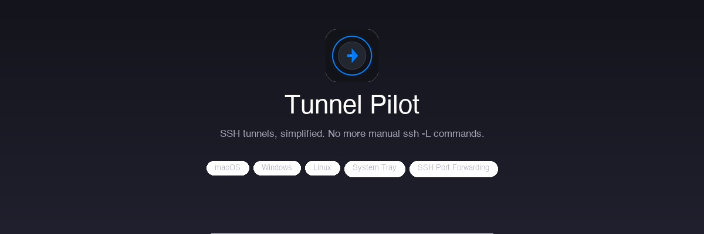

<p align="center">
  
</p>

<p align="center">
  <a href="https://github.com/kalfian/tunnel-pilot/actions/workflows/ci.yml"></a>
  
  
  
  
  
</p>

<p align="center">
  <b>Website</b>: <a href="https://kalfian.github.io/tunnel-pilot">kalfian.github.io/tunnel-pilot</a>
</p>

Manage your SSH tunnels (`ssh -L`) with ease — toggle connections on/off directly from the tray menu, configure tunnels through a clean settings interface, and get notified when connection status changes.

## Features

- **System Tray / Menu Bar** — Lives entirely in the menu bar (macOS) or system tray (Windows/Linux)
- **Quick Toggle** — Turn SSH tunnels on/off from the tray menu with colored status indicators
- **Connection Status** — Green (connected), Yellow (connecting), Red (error), White (disconnected)
- **Settings Window** — Manage all tunnel configurations in a clean interface
- **Add / Edit / Duplicate / Delete** — Full CRUD for tunnel configurations
- **Double-click to Edit** — Quick editing of existing tunnels
- **Password & Identity File Auth** — Supports SSH password or identity file authentication
- **Backup & Restore** — Export/import configurations as JSON (passwords excluded for security, identity file paths included)
- **Launch at Login** — Start Tunnel Pilot automatically when you log in
- **Desktop Notifications** — Get notified on connection status changes
- **Multi-platform** — macOS, Windows, Linux

## Prerequisites

- [Flutter SDK](https://flutter.dev/docs/get-started/install) (3.11.1+)
- **macOS**: Xcode with command line tools
- **Windows**: Visual Studio with C++ desktop development workload
- **Linux**: Standard build tools plus:
  ```bash
  sudo apt-get install libayatana-appindicator3-dev libnotify-dev
  ```

## Getting Started

### Install dependencies

```bash
flutter pub get
```

### Run in development

```bash
# macOS
flutter run -d macos

# Windows
flutter run -d windows

# Linux
flutter run -d linux
```

### Build for release

```bash
# macOS
flutter build macos

# Windows
flutter build windows

# Linux
flutter build linux
```

Release builds are located in:
- macOS: `build/macos/Build/Products/Release/Tunnel Pilot.app`
- Windows: `build/windows/x64/runner/Release/tunnel_pilot.exe`
- Linux: `build/linux/x64/release/bundle/tunnel_pilot`

## Running Tests

```bash
flutter test
```

## macOS: Gatekeeper Warning

Since the app is not signed with an Apple Developer certificate, macOS will show a warning on first launch. To allow it:

1. Try to open **Tunnel Pilot.app** — macOS will block it
2. Go to **System Settings → Privacy & Security**
3. Scroll down to the **Security** section — you'll see a message about "Tunnel Pilot" being blocked
4. Click **Open Anyway** and confirm

Alternatively, remove the quarantine attribute via terminal:
```bash
xattr -cr "/Applications/Tunnel Pilot.app"
```

## Security Notes

- SSH passwords are stored locally on your device in a JSON config file
- Passwords are **never** included in backup exports — after restoring a backup, you must re-enter passwords for each tunnel
- Identity file paths are stored as references (not copied) and are included in backups
- Consider using SSH identity files instead of passwords for better security

## Project Structure

```
lib/
  main.dart                     # App entry point
  app.dart                      # MaterialApp configuration
  models/                       # Data models
  services/                     # SSH, storage, tray, notifications
  providers/                    # State management (Provider)
  screens/                      # Settings window
  widgets/                      # Reusable UI components
```

## License

MIT
