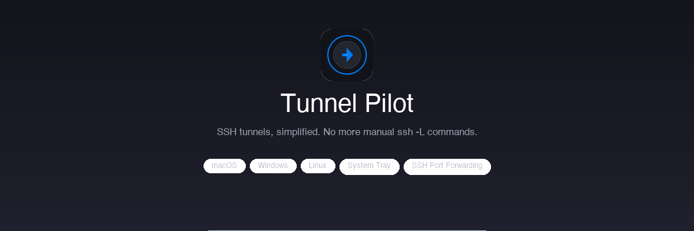
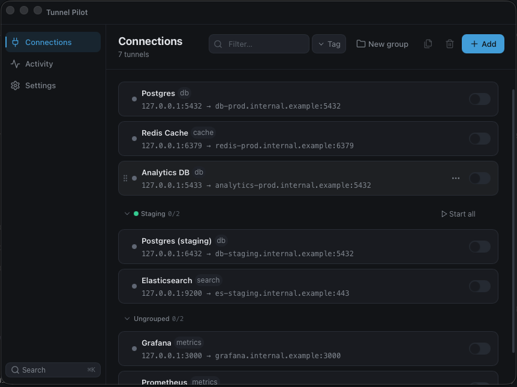
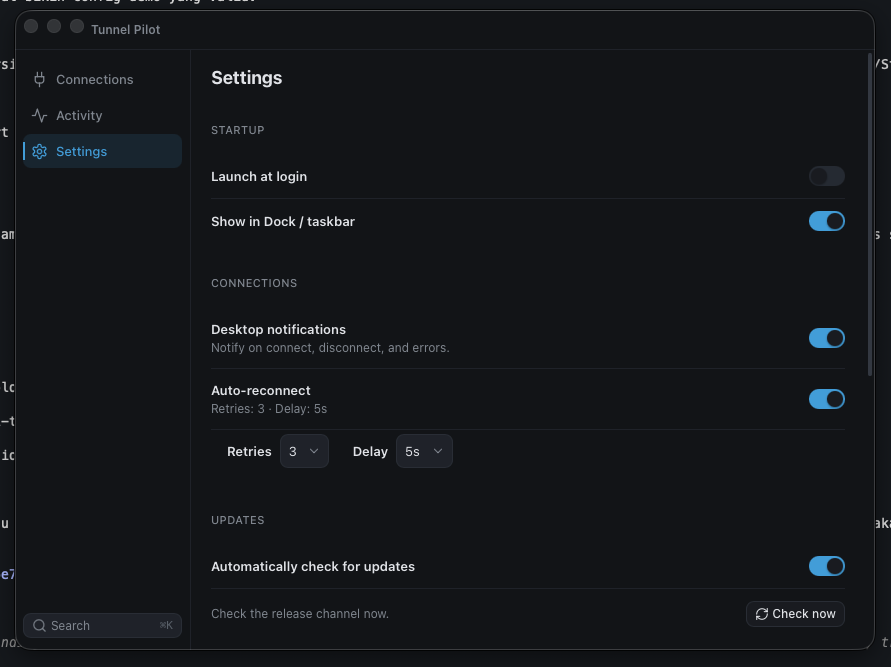
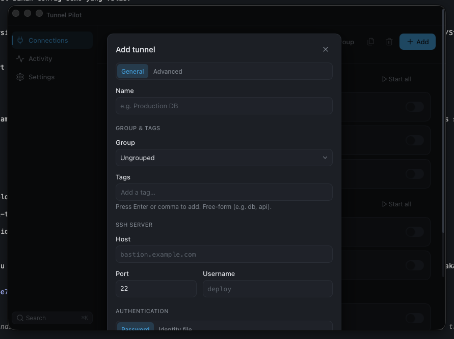
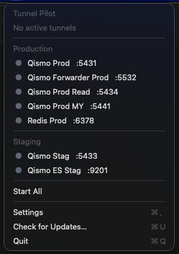
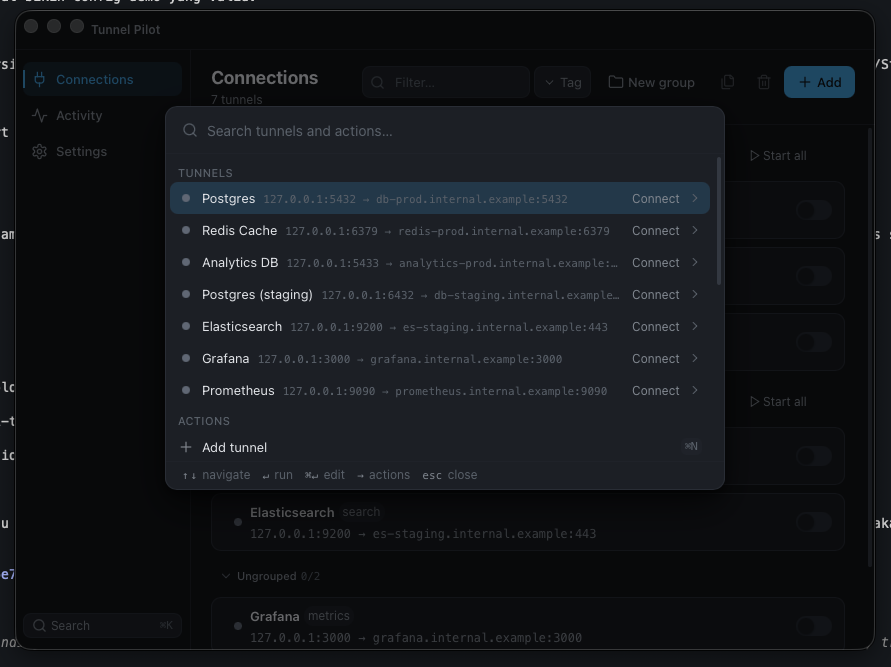

<p align="center">
  
</p>

<p align="center">
  <a href="https://github.com/kalfian/tunnel-pilot/releases/latest"></a>
  
  
  
  
  
  
</p>

<p align="center">
  <b>Website</b>: <a href="https://kalfian.github.io/tunnel-pilot">kalfian.github.io/tunnel-pilot</a>
</p>

Manage your SSH tunnels (`ssh -L`) with ease — toggle connections on/off directly from the tray menu, configure tunnels through a clean settings window, and get status at a glance. Tunnel Pilot lives entirely in the menu bar (macOS) or system tray (Windows/Linux) — no Dock icon by default.

> **Tunnel Pilot 2.0 is a full rewrite in Rust + Tauri v2.** The app now idles in roughly **15–30 MB of RAM** (down from ~100–200 MB on the Flutter v1 build), starts faster, and adds a ⌘K command palette, groups/tags, a resizable/responsive window, OS-keychain credential storage, and a **cryptographically signed self-updater**. See [Upgrading from v1](#upgrading-from-v1) — **your saved tunnels are preserved automatically.**

<p align="center">
  
  
  
</p>

<p align="center">
  
  
</p>

## Features

- **System Tray / Menu Bar** — Lives entirely in the menu bar (macOS) or system tray (Windows/Linux); dynamic tray icon shows the active connection count.
- **Quick Toggle** — Turn SSH tunnels on/off from the tray menu or the window with colored status indicators (connected / connecting / error / disconnected).
- **Full CRUD** — Add / edit / duplicate / delete tunnel configurations; drag to reorder or drag a tunnel between groups; edit from each row's actions.
- **Command Palette (⌘K)** — Fuzzy-search every action: connect/disconnect, jump to a view, toggle theme, check for updates, and more.
- **Groups & Tags** — Organize tunnels into collapsible groups and filter by tag; start/stop a whole group at once.
- **Password & Identity File Auth** — SSH password or identity file. Passwords are stored in your **OS keychain** (Keychain / Windows Credential Manager / Secret Service), with an encrypted local fallback when no keychain is available.
- **Auto-Reconnect & Keep-Alive** — Configurable backoff, SSH keep-alive liveness, and wake-from-sleep recovery.
- **Backup & Restore** — Export/import configurations as JSON (passwords excluded for security; identity file paths included). Non-destructive **merge** or **replace** import.
- **Launch at Login** — Start Tunnel Pilot automatically when you log in.
- **Signed Auto-Updates** — Update bundles are **minisign-signed** and verified against a public key embedded in the app before install (see [Security & signing](#security--signing)).
- **Copy SSH Command** — Copy the equivalent `ssh -N -L …` command for any tunnel.
- **Logs Viewer** — In-memory activity log (last 500 entries) with copy/clear.
- **CLI / automation (macOS & Linux)** — Control the running app from a terminal or a script: `tunnel-pilot list|status|connect|disconnect`, with `--json` output and meaningful exit codes. See [CLI / automation](#cli--automation).
- **Multi-platform** — macOS, Windows, Linux.

## Tech stack

- **Backend / core**: Rust + [Tauri v2](https://tauri.app), [`russh`](https://crates.io/crates/russh) for the SSH engine and port forwarding, `tokio` async runtime, [`keyring`](https://crates.io/crates/keyring) for OS-keychain credential storage.
- **Frontend**: Svelte 5 + TypeScript + Vite, talking to Rust over Tauri's typed IPC.
- **Updater**: `tauri-plugin-updater` with minisign-signed bundles, published to GitHub Releases.

## Install

Download the latest build for your OS from [**GitHub Releases**](https://github.com/kalfian/tunnel-pilot/releases/latest):

| OS | Artifact | Install |
|----|----------|---------|
| **macOS** | `.dmg` | Open the `.dmg`, drag **Tunnel Pilot** to `/Applications`. |
| **Windows** | `.exe` (NSIS installer) | Run the installer and follow the prompts. |
| **Linux** | `.AppImage`, `.deb`, `.rpm` | AppImage: `chmod +x` then run. `.deb`/`.rpm`: install with your package manager. |

### First launch — unsigned build workarounds

**Tunnel Pilot is open-source and not code-signed** (signing certificates cost money this project doesn't have). Your OS may warn on first launch — this is expected and safe. Here's how to open it:

- **macOS** — Gatekeeper will say the app "cannot be opened because the developer cannot be verified." Right-click (or Control-click) the app in Finder → **Open** → **Open** in the dialog. You only need to do this once. (Or: System Settings → Privacy & Security → "Open Anyway".)
- **Windows** — SmartScreen will show "Windows protected your PC." Click **More info** → **Run anyway**.
- **Linux** — AppImage: `chmod +x Tunnel-Pilot*.AppImage` then run it. `.deb`/`.rpm` install normally.

> Note: this only affects the *installer / first launch*. **Auto-updates are cryptographically signed and verified** (minisign) regardless — that protection is always on.

## Upgrading from v1

Tunnel Pilot v1 (Flutter) and v2 (Tauri) use **incompatible update mechanisms**, so the first hop from v1 to v2 is a **one-time manual download**. After that, all future v2 updates are automatic and signed.

### Your tunnels are preserved

**You will not lose your saved tunnels.** Your configuration lives in the OS app-support directory, *outside* the app itself, so replacing the app never touches it. On first launch, v2 automatically detects and imports your v1 config, and **passwords are moved into your OS keychain** for you. (No dry-run needed — it just works.)

### Per-OS upgrade steps

- **macOS** — Download the v2 `.dmg` and drag **Tunnel Pilot** over `/Applications`, overwriting v1 in place (same app name / location). After first run, if a duplicate "Tunnel Pilot" appears in **System Settings → General → Login Items**, remove the stale one (v1 and v2 register launch-at-login differently).
- **Windows** — v1 shipped as a portable folder with no uninstaller, so **delete your old Tunnel Pilot portable folder** manually, then run the v2 installer. Your config is untouched by this.
- **Linux** — v1 never shipped on Linux, so this is a **fresh install** — nothing to migrate.

## CLI / automation

*macOS and Linux.* While the app is running it listens on a Unix socket at
`<app config dir>/cli/cli.sock` (`0600`, inside a `0700` directory — only your user can talk
to it). The app binary **is** the CLI, so no extra download is needed:

```bash
# one-off
"/Applications/Tunnel Pilot.app/Contents/MacOS/tunnel-pilot" list

# put it on your PATH (optional)
sudo ln -sf "/Applications/Tunnel Pilot.app/Contents/MacOS/tunnel-pilot" /usr/local/bin/tunnel-pilot
```

| Command | What it does |
|---|---|
| `tunnel-pilot list` | Every configured forward with its live status |
| `tunnel-pilot status <id\|name>` | One forward: endpoints, status, stats |
| `tunnel-pilot connect <id\|name>` | Connect and **wait** for `connected` or `error` |
| `tunnel-pilot disconnect <id\|name>` | Disconnect (waits for teardown) |
| `tunnel-pilot connect-all` / `disconnect-all` | The tray's Start All / Stop All |
| `tunnel-pilot version` / `help` | App + protocol version / usage |

Flags: `--json`, `--timeout <secs>` (1–300, default 30), `--no-wait`, `--socket <path>`.
A target is a forward **id** (exact) or **name** (case-insensitive, exact); an ambiguous
name is rejected rather than guessed.

```console
$ tunnel-pilot list
STATUS        NAME           LOCAL             REMOTE                  ID
connected     prod-db        127.0.0.1:5432    db.internal:5432        9f3c1a02-…
disconnected  staging-redis  127.0.0.1:6379    redis.internal:6379     1b77e5d4-…

$ tunnel-pilot connect prod-db --json
{"forward":{"id":"9f3c1a02-…","name":"prod-db","status":"connected", …},"waited":true,"timedOut":false}
```

Exit codes — designed for scripts and agents:

| Code | Meaning |
|---|---|
| 0 | success |
| 1 | internal / IO error |
| 2 | usage error |
| 3 | Tunnel Pilot is not running (start it with `open -a "Tunnel Pilot"`) |
| 4 | target not found, or ambiguous |
| 5 | the operation ended in `error` (e.g. auth failed) |
| 6 | timed out waiting for a terminal status |

`status` exits `0` whenever the query succeeded — read the status from the payload.

Notes: the CLI talks to a **running** app and never launches it for you. It cannot read or
set passwords — credentials stay a GUI + keychain concern. Set `TUNNEL_PILOT_SOCKET` (both
sides) if the default socket path is too long for your system's `sun_path` limit.

## Build from source

Requirements: [Rust](https://rustup.rs) (stable), [Node.js](https://nodejs.org) 18+, and [pnpm](https://pnpm.io).

```bash
git clone https://github.com/kalfian/tunnel-pilot.git
cd tunnel-pilot
pnpm install

# Run in development (hot-reload)
pnpm tauri dev

# Build release bundles for the current OS
pnpm tauri build
```

**Linux** additionally needs the Tauri system dependencies:

```bash
sudo apt-get install -y libwebkit2gtk-4.1-dev libgtk-3-dev librsvg2-dev \
  libayatana-appindicator3-dev libssl-dev libxdo-dev build-essential curl wget file
```

### Tests

```bash
cargo test --manifest-path src-tauri/Cargo.toml   # Rust core
pnpm test                                          # frontend (Vitest)
```

## Security & signing

Tunnel Pilot has **two independent signing tiers** — keep them straight:

| Tier | Protects | Status |
|------|----------|--------|
| **Updater bundle signing (minisign)** | Self-update integrity — each update bundle is verified against a public key embedded in the app; tampered/unsigned bundles are rejected. | **Enabled** (free, self-generated keypair). |
| **OS code-signing / notarization** (Apple Developer ID, Windows Authenticode) | Gatekeeper / SmartScreen at *install* time. | **Skipped** — open-source and unfunded; certs cost money. Use the [first-launch workarounds](#first-launch--unsigned-build-workarounds). |

So: **auto-updates are always signed and verified**, even though the installer itself is unsigned. Enabling OS code-signing later is a drop-in change if the project ever gets funding.

Other notes:
- SSH passwords are stored in your **OS keychain** (encrypted local fallback only when no keychain is present).
- Passwords are **never** included in backup exports — after importing a backup you must re-enter passwords.
- Identity file paths are stored as references (not copied) and are included in backups.

## License

MIT
