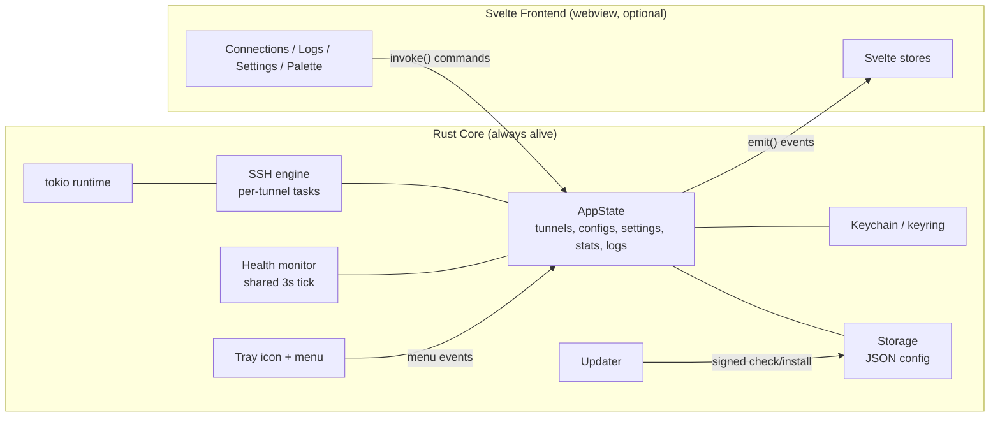

# 02 — Architecture: Tunnel Pilot v2 (Tauri v2 + Rust + Svelte)

> How the app is structured: processes, threads, crate/module layout, the complete IPC
> command catalog, the event catalog, state ownership, and plugin config.
> Cross-refs: [01-PRD.md](01-PRD.md), [03-TECH-SPEC.md](03-TECH-SPEC.md),
> [04-DATA-MODEL.md](04-DATA-MODEL.md), [07-ROADMAP.md](07-ROADMAP.md),
> [AGENTS.md](AGENTS.md).

## 1. High-level model

Tauri v2 gives us two logical sides that communicate over IPC:

- **Core (Rust)** — the process that owns the tray, the tokio runtime, all SSH tunnels,
  persistence, keychain, updater, and app lifecycle. It runs even when the window is
  hidden. **This is where all real work happens.** The window/webview is optional.
- **Frontend (Svelte + TS in the webview)** — pure presentation. It holds no source of
  truth beyond ephemeral UI state; it renders snapshots pushed from Rust and issues
  commands. When the window is hidden the webview may be torn down; the frontend must be
  able to fully rehydrate from Rust on show.



## 2. Process & threading model

- **Single OS process** (`tauri-plugin-single-instance` enforces one). No child processes
  for SSH — `russh` is in-process async.
- **One multi-threaded tokio runtime** owned by the Tauri app, started in `main()` /
  `setup`. All async SSH/network work runs here.
- **Per-tunnel supervisor task**: each tunnel owns **one long-lived** tokio task that owns
  its russh session internally and **loops across reconnect attempts** (so its `JoinHandle`
  identity is stable for the tunnel's life, F21). It holds the accept-loop for local
  connections; each accepted socket spawns a child copy task. It uses a **two-level
  `CancellationToken`** (durable parent + per-attempt child, F6); disconnect = cancel parent +
  await this task's JoinHandle before removing the registry entry (releases the port first).
  It also runs the per-tunnel latency RTT probe (owning the session) and publishes stats into
  a `watch` cell. Replaces v1's generation-counter guard with real structured cancellation
  (see [03 §1/§5](03-TECH-SPEC.md#concurrency)).
- **Single shared stats/latency EMIT sampler**: one `tokio::time::interval(3s)` loop reading
  each tunnel's stats `watch` cell and emitting `tunnel://stats`. It holds **no session** and
  **never tears down** — liveness is owned by russh keepalive + the session-future signal
  (F1). Auto-starts on first connect, stops when no tunnels remain
  (see [03 §2/§6](03-TECH-SPEC.md#keepalive)).
- **Tray & menu** run on the platform's main/event thread (Tauri requirement for UI
  objects). Menu rebuilds are marshalled to the main thread via `AppHandle`.
- **Wake detection**: a low-frequency monotonic-clock watchdog task detects time gaps
  (>30s) implying sleep/resume (see [03 §wake](03-TECH-SPEC.md#wake)).

Communication between the tokio async world and the Tauri/tray main thread goes through
`AppHandle` (clonable, `Send + Sync`) for `emit`/menu updates, and through shared state
guarded by async locks for data.

## 3. Rust crate layout (`src-tauri/`)

```
src-tauri/
  Cargo.toml
  tauri.conf.json
  build.rs
  icons/                     # app + generated icon set
  src/
    main.rs                  # entrypoint: builder, plugins, setup, run
    lib.rs                   # (optional) shared for integration tests
    error.rs                 # AppError (thiserror) + Result alias; serde-serializable for IPC
    state/
      mod.rs                 # AppState struct + accessors, wired as tauri::State
      tunnel_registry.rs     # map<TunnelId, TunnelHandle>: cancellation tokens, stats, status
      settings_state.rs      # in-memory AppSettings mirror
      log_buffer.rs          # ring buffer (cap 500) of LogEntry
    ssh/
      mod.rs
      engine.rs              # long-lived per-tunnel supervisor: connect/reconnect loop, owns session, 5×500ms bind-retry, set_status authority
      client.rs              # russh Handler impl, auth (password/identity), keepalive_interval/keepalive_max
      forward.rs             # local accept loop + direct-tcpip channel piping + byte counters
      health.rs              # shared 3s stats/latency EMIT sampler (reads stats_cell); NO session, NO teardown (F1/F21)
      reconnect.rs           # backoff() helper (loop lives in engine.rs supervisor, F21)
      wake.rs                # sleep/wake watchdog (best-effort; session-future signal is backstop, F15)
      stats.rs               # TunnelStats accounting
    storage/
      mod.rs
      config_file.rs         # atomic read-merge-write of tunnel_pilot_config.json; corruption handling
      migration.rs           # v1 -> v2 detection + import (incl. plaintext pwd -> keychain)
      backup.rs              # export (strip passwords) / import (validate, replace|merge)
    credentials/
      mod.rs                 # keychain via `keyring`; feature-detect; plaintext fallback + warning flag
    tray/
      mod.rs
      icon.rs                # dynamic count icon selection (idle grey / badge 1-9), template on macOS
      menu.rs                # menu build + rebuild-on-change; per-tunnel rows; bulk actions; update notice
    updater/
      mod.rs                 # tauri-plugin-updater wiring; check/download/install; progress events
    window/
      mod.rs                 # hide-on-close intercept; show/focus; single-instance re-show
    platform/
      mod.rs
      dock.rs                # macOS activation-policy; Win/Linux skipTaskbar
      autostart.rs           # tauri-plugin-autostart sync
      notify.rs              # tauri-plugin-notification wrapper; permission timing
    commands/
      mod.rs                 # re-export + invoke_handler list
      forwards.rs            # CRUD, reorder, duplicate, connect/disconnect, retry, copy-ssh-command
      groups.rs              # group/tag CRUD, bulk start/stop, filter helpers
      settings.rs            # get/set settings
      logs.rs                # get logs, clear, copy-all payload
      backup.rs              # export/import commands
      updater.rs             # check/install commands
      app.rs                 # snapshot/hydrate, window show/hide, quit
    events.rs                # event name constants + payload structs (serde) emitted to FE
```

Suggested crate deps (see [AGENTS.md](AGENTS.md) for full policy): `tauri` (v2),
`tokio` (rt-multi-thread, net, time, io-util, sync), `tokio-util` (CancellationToken),
**`russh = "0.45"` + `russh-keys = "0.45"`** (pinned — see [03 Conventions/F16](03-TECH-SPEC.md)),
`serde`/`serde_json`, `thiserror`, `anyhow` (bin edges only),
`tracing` + `tracing-subscriber`, `uuid` (v4), `chrono` or `time`,
`fuzzy-matcher` (palette; optional — palette search may live in FE).

**`keyring` needs per-target features (F9)** — v3 ships no backend by default, so pin them
per OS or `keychain_available()` is always false (full block in [03 §9](03-TECH-SPEC.md#credentials)):
`apple-native` (macOS), `windows-native` (Windows), `sync-secret-service` + `crypto-rust` (Linux).

Plugins: `tauri-plugin-autostart`, `tauri-plugin-notification`, `tauri-plugin-single-instance`,
`tauri-plugin-updater`, **`tauri-plugin-clipboard-manager`** (F14 — the clipboard mechanism for
copy-ssh-command + Logs "Copy All"; do not invent another), `tauri-plugin-dialog` (file picker),
`tauri-plugin-store` (optional; we use custom fs for the main config).

## 4. Svelte frontend layout (`src/`)

```
src/
  main.ts                    # mount app; call app_hydrate() on boot; subscribe to events
  App.svelte                 # shell: tab nav (Connections/Logs/Settings) + palette host
  lib/
    ipc.ts                   # typed wrappers over invoke() — ONE function per command (contract)
    events.ts                # typed listen() subscriptions -> store updates
    types.ts                 # TS types mirroring Rust models (see 04-DATA-MODEL.md)
    stores/
      forwards.ts            # writable<ForwardConfig[]> + status/stats maps
      groups.ts              # groups + active tag filter
      settings.ts            # AppSettings mirror + theme
      logs.ts                # LogEntry[] (mirrors Rust ring buffer via events)
      updater.ts             # update availability + progress
      palette.ts             # command palette open state + query
    components/
      ConnectionRow.svelte
      ConnectionList.svelte
      GroupHeader.svelte
      StatusBadge.svelte
      StatChips.svelte       # bytes/latency/uptime, monospace
      ForwardForm.svelte     # add/edit dialog (keepalive fields, keychain warning)
      ConfirmDialog.svelte
      CommandPalette.svelte  # Cmd/Ctrl+K fuzzy search + actions
      TagFilterBar.svelte
    routes/                  # if using a router; else tab views:
      ConnectionsView.svelte
      LogsView.svelte
      SettingsView.svelte
```

Frontend visual details (design tokens, monospace stack, states) are owned by the design
agent — see [05-UI-UX-SPEC.md](05-UI-UX-SPEC.md). This file only defines data flow and
component responsibilities.

## 5. State ownership

**Source of truth is Rust `AppState`.** Svelte stores are read-through mirrors kept in
sync by events. Never let the frontend hold authoritative tunnel/connection state — a
window reopen must fully rehydrate from Rust.

| Data | Owner (Rust) | Frontend mirror |
|------|--------------|-----------------|
| ForwardConfig list (+ order) | `AppState.configs` (persisted) | `stores/forwards` |
| Live status per tunnel (5-state) | `tunnel_registry`; written ONLY via `set_status` under the registry lock — supervisor owns connecting/connected/error, command handler owns disconnecting/disconnected (F23, [03 §1](03-TECH-SPEC.md#ssh)) | `stores/forwards` (status map) |
| TunnelStats (bytes/latency/uptime/conns) | `stats` per tunnel | `stores/forwards` (stats map) |
| Groups / tags | `AppState.groups` (persisted) | `stores/groups` |
| AppSettings | `settings_state` (persisted) | `stores/settings` |
| Logs (ring buffer, 500) | `log_buffer` (not persisted) | `stores/logs` (via events) |
| Cancellation tokens / task handles | `tunnel_registry` only | — (never crosses IPC) |
| Keychain secrets | `credentials` / OS keychain | never crosses IPC in plaintext |
| Update availability/progress | `updater` | `stores/updater` |
| UI ephemeral (open dialog, palette query, tab) | — | Svelte stores only |

## 6. IPC command catalog (`#[tauri::command]`)

All commands return `Result<T, AppError>` where `AppError` is serde-serializable
(see [error.rs] in §3 and [03](03-TECH-SPEC.md)). Types are defined in
[04-DATA-MODEL.md](04-DATA-MODEL.md). The TS wrappers in `lib/ipc.ts` are the
**contract source of truth** (see [AGENTS.md](AGENTS.md)).

### 6.1 Forwards (`commands/forwards.rs`)

| Command | Signature (Rust args → return) | Triggered by |
|---------|--------------------------------|--------------|
| `list_forwards` | `() -> Vec<ForwardConfig>` | boot / rehydrate |
| `create_forward` | `(input: ForwardInput) -> ForwardConfig` | ForwardForm save (new) |
| `update_forward` | `(id: String, input: ForwardInput) -> ForwardConfig` | ForwardForm save (edit); force-disconnects if connected first |
| `delete_forward` | `(id: String) -> ()` | ConfirmDialog delete |
| `duplicate_forward` | `(id: String) -> ForwardConfig` | row action; name gets " (copy)" |
| `reorder_forwards` | `(ordered_ids: Vec<String>) -> ()` | drag-drop reorder |
| `connect_forward` | `(id: String) -> ()` | toggle on / palette |
| `disconnect_forward` | `(id: String) -> ()` | toggle off / palette (user-initiated → silent) |
| `retry_forward` | `(id: String) -> ()` | click while status=error |
| `start_all` | `() -> ()` | tray "Start All" / palette / keymap — global bulk connect (v1 `connectAll`) |
| `stop_all` | `() -> ()` | tray "Stop All" / palette / keymap — global bulk disconnect (v1 `disconnectAll`) |
| `get_forward_runtime` | `(id: String) -> ForwardRuntime` | on-demand status+stats snapshot |
| `copy_ssh_command` | `(id: String) -> String` | "Copy SSH command" action |
| `set_forward_password` | `(id: String, password: String) -> ()` | form save when password entered (writes to keychain/fallback) |
| `clear_forward_password` | `(id: String) -> ()` | form clears password |

`ForwardInput` = editable subset of `ForwardConfig` (no `id`, no live state); password is
**never** part of it — passwords flow only through `set_forward_password` /
`clear_forward_password`. See [04](04-DATA-MODEL.md).

**Form flow ordering (nit a):** creating a forward WITH a password is a two-call sequence —
(1) `create_forward(input)` returns the new `ForwardConfig` with its generated `id`, then
(2) `set_forward_password(id, password)` using that id. The form must await (1) before (2);
never send the password inside `ForwardInput`. Editing follows the same pattern with the
existing id.

`ForwardRuntime` = `{ status: ForwardStatus, stats: TunnelStats, lastError: Option<String> }`.

### 6.2 Groups & tags (`commands/groups.rs`)

| Command | Signature | Triggered by |
|---------|-----------|--------------|
| `list_groups` | `() -> Vec<TunnelGroup>` | boot / rehydrate |
| `create_group` | `(input: GroupInput) -> TunnelGroup` | new group |
| `update_group` | `(id: String, input: GroupInput) -> TunnelGroup` | rename/recolor |
| `delete_group` | `(id: String) -> ()` | delete group (forwards keep tags, groupId cleared) |
| `assign_forward_group` | `(forward_id: String, group_id: Option<String>) -> ()` | drag into folder |
| `start_group` | `(group_id: String) -> ()` | Start All per group |
| `stop_group` | `(group_id: String) -> ()` | Stop All per group |
| `list_tags` | `() -> Vec<String>` | tag filter bar |

### 6.3 Settings (`commands/settings.rs`)

| Command | Signature | Triggered by |
|---------|-----------|--------------|
| `get_settings` | `() -> AppSettings` | boot / rehydrate |
| `update_settings` | `(input: AppSettings) -> AppSettings` | Settings tab change (applies autostart/dock/theme side effects) |

### 6.4 Logs (`commands/logs.rs`)

| Command | Signature | Triggered by |
|---------|-----------|--------------|
| `get_logs` | `() -> Vec<LogEntry>` | open Logs tab / rehydrate |
| `clear_logs` | `() -> ()` | Clear button |
| `get_logs_text` | `() -> String` | Copy All (formatted lines) |

### 6.5 Backup (`commands/backup.rs`)

| Command | Signature | Triggered by |
|---------|-----------|--------------|
| `export_backup` | `(path: String) -> ()` | export (writes BackupFile, passwords stripped) |
| `import_backup` | `(path: String, mode: ImportMode) -> ImportResult` | import; `mode` = `Replace`\|`Merge`; validates + rejects version>current |

`ImportMode` enum `{ Replace, Merge }`; `ImportResult` = `{ imported: usize, skipped: usize, replaced: bool }`.

### 6.6 Updater (`commands/updater.rs`)

| Command | Signature | Triggered by |
|---------|-----------|--------------|
| `check_update` | `() -> UpdateStatus` | manual "Check for updates" / autoCheck on boot |
| `install_update` | `() -> ()` | user accepts; downloads + verifies signature + installs; emits progress |
| `skip_update` | `(version: String) -> ()` | "Skip this version" → sets `lastSkippedVersion` |

`UpdateStatus` = `{ available: bool, version: Option<String>, notes: Option<String>, skipped: bool }`.

### 6.7 App / window (`commands/app.rs`)

| Command | Signature | Triggered by |
|---------|-----------|--------------|
| `app_hydrate` | `() -> AppSnapshot` | frontend boot — one call returns forwards+groups+settings+logs+runtime+update status |
| `show_window` | `() -> ()` | tray "Open" |
| `hide_window` | `() -> ()` | custom close button |
| `quit_app` | `() -> ()` | tray "Quit" / palette |

`AppSnapshot` = `{ forwards, groups, settings, logs, runtimes: Vec<(String, ForwardRuntime)>, update: UpdateStatus, keychain_available: bool }`.
`keychain_available` drives the plaintext-fallback warning UI.

## 7. Event catalog (Rust → Frontend, via `AppHandle::emit`)

Names are constants in `events.rs`. Payloads are serde structs. Frontend subscribes in
`lib/events.ts` and updates stores. Emit only on change (coalesce stats).

| Event name | Payload | Meaning |
|------------|---------|---------|
| `tunnel://status` | `{ id: String, status: ForwardStatus, lastError: Option<String> }` | status transition |
| `tunnel://stats` | `{ id: String, stats: TunnelStats }` | stats update on the single 3s sampler tick ([03 §6/F4](03-TECH-SPEC.md#stats)) |
| `log://line` | `LogEntry` | new log line appended |
| `log://cleared` | `()` | logs cleared |
| `forwards://changed` | `Vec<ForwardConfig>` | config list mutated (CRUD/reorder/migration) |
| `groups://changed` | `Vec<TunnelGroup>` | groups mutated |
| `settings://changed` | `AppSettings` | settings changed (e.g. theme applied elsewhere) |
| `update://status` | `UpdateStatus` | availability changed |
| `update://progress` | `{ downloaded: u64, total: Option<u64> }` | download progress |
| `window://focus` | `()` | window re-shown (e.g. via single-instance) → FE may refresh |

## 8. Plugins & config

| Plugin | Purpose | Notes |
|--------|---------|-------|
| tray-icon (core in v2) | Tray icon + menu | Dynamic icon + menu rebuild in `tray/`. |
| `tauri-plugin-single-instance` | One process | Register first; on second launch → `show_window` + emit `window://focus`. |
| `tauri-plugin-autostart` | Launch at login | Synced with `launchAtLogin` on every boot (`platform/autostart.rs`). |
| `tauri-plugin-notification` | Desktop notifications | Unified across OS; permission timing in `platform/notify.rs`. **May silently fail on the unsigned macOS build (F5)** — verify in M6. |
| `tauri-plugin-updater` | Self-update with **minisign-signed bundles** | Minisign pubkey in `tauri.conf.json`; endpoint = same GitHub Releases. Updater-bundle signing is separate from (deferred) OS code-signing. See [03 §16](03-TECH-SPEC.md#updater), [06](06-MIGRATION-REPO.md). |
| `tauri-plugin-clipboard-manager` | Clipboard (F14) | Copy SSH command + Logs "Copy All". The one clipboard mechanism — coder must not invent another. |
| `tauri-plugin-dialog` | File picker | Identity file + backup path selection; scope in capabilities. |
| `tauri-plugin-store` (optional) | Small KV | Main config uses custom fs (`storage/`); store only if convenient for trivial prefs. |

`tauri.conf.json` highlights (detailed in [03](03-TECH-SPEC.md) & [06](06-MIGRATION-REPO.md)):
- Window: `visible:false` at startup (starts hidden → tray), `resizable:true`, `minWidth`/`minHeight` set, decorations per design.
- macOS: `LSUIElement=true` (agent app), activation-policy switching at runtime for dock.
- Updater: `pubkey`, `endpoints` → GitHub Releases `latest.json`. **NOTE (found in M0):**
  `tauri-plugin-updater` v2 is **not a bare no-op** — registering it (`Builder::new().build()`)
  panics at launch unless a `plugins.updater` config block exists (`PluginInitialization`:
  it deserializes to a required `Config` struct, so a missing/`null` block errors). Therefore
  M0 ships a minimal block with `pubkey: ""` + a placeholder `endpoints` entry (the pubkey is
  only parsed at verify time, so empty is fine at init). M6 replaces the pubkey with the real
  minisign public key. (There is no `active` field in the v2 plugin config — that was v1.)
- Capabilities (v2 ACL): expose only the commands above to the main window; restrict fs/dialog scopes.
